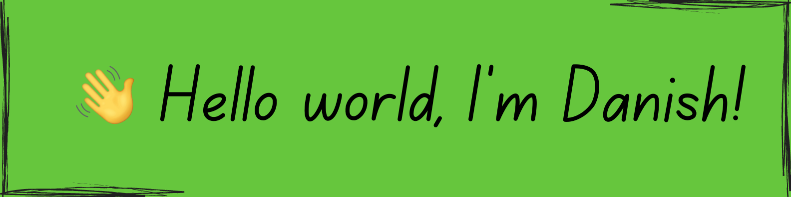

<!---
<h3 align="center">

</h3>
--->

<h3 align="center">About Me :</h3>  
 

 👋  I'm Danish, a self-motivated tech enthusiast.
  💻 Currently working as programmer analyst <a href="./">@Cognizant</a>
 🌱 building <a href="./">Message encryption tool</a>
 💬 connect <a href="./">danishdanish020@gmail.com</a>
 

 
<h3 align="center">
My Tech Stacks
</h3>

 

      

    
 
    

<!---
Danish-uddin/Danish-uddin is a ✨ special ✨ repository because its `README.md` (this file) appears on your GitHub profile.
You can click the Preview link to take a look at your changes.
--->
